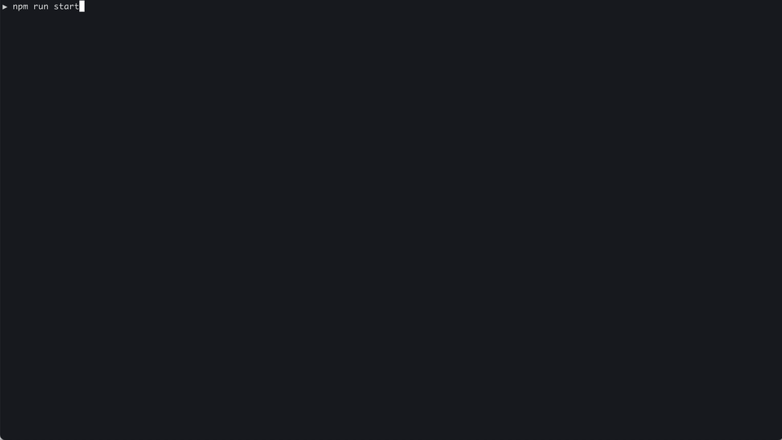

# 🛠️ LLM-Powered Node.js CRUD API template

<p align="center">
  </a>
</p>

  [](https://makeapullrequest.com/)

## Description
An LLM-powered code generation tool that relies on the built-in [Node.js API Typescript Template Project](#nodejs-api-typescript-template-project) to easily generate clean, well-structured CRUD module code from text description.


### Prerequisites
Before you proceed, verify that Node.js and npm are installed, and update your `.env` file with a valid LLM provider API key (e.g., `OPENAI_API_KEY`). You may choose from providers like OpenAI, Claude, DeepSeek, or OpenRouter/Llama.

### How it works?
It orchestrates 3 LLM micro-agents (`Developer`, `Troubleshooter` and `TestsFixer`) to generate code, fix compilation errors, and ensure passing E2E tests. The process includes module code generation, DB migration creation, seeding data, and running tests to validate output. By cycling through these steps, it guarantees consistent and production-ready CRUD code aligned with vertical slicing architecture. It uses OpenAI/Anthropic/DeepSeek/Llama LLM API to perform code-generation

### How to run?
First, navigate to the root `./llm-codegen` folder and run `npm install` to install dependencies. Then execute `npm run start` and provide the requested module description when prompted. Finally, after the code generation finishes, review the output, and if the output meets your expectations, begin integrating it into your codebase




---

# Node.js API Typescript Template Project

## Description

This project is a simple Node.js boilerplate using TypeScript and Docker. It demonstrates vertical slicing architecture for a REST API, as detailed here: [https://markhneedham.com/blog/2012/02/20/coding-packaging-by-vertical-slice/](https://markhneedham.com/blog/2012/02/20/coding-packaging-by-vertical-slice/). Unlike horizontal slicing (layered architecture), vertical slicing reduces the model code gap, making the modeled domain easier to understand. The implementation also follows the principles of Clean Architecture by Uncle Bob: [https://blog.cleancoder.com/uncle-bob/2012/08/13/the-clean-architecture.html](https://blog.cleancoder.com/uncle-bob/2012/08/13/the-clean-architecture.html).

The application provides APIs for users to get, create, update, and delete Todo (CRUD operations)

## Features

- Vertical slicing architecture based on **DDD & MVC** principles
- Services input validation using **ZOD**
- Decoupling application components through dependency injection using **InversifyJS**
- Integration and E2E testing with **Supertest**
- **Docker-compose** simplifies multi-service setup, running application, DB, and Redis in isolated docker containers easily
- Simple DB transaction management with **Knex**
- Multi-layer trace ID support for logging with **winston**
- Support graceful shutdown for the **express.js** server
- In-memory data storage and caching with **ioredis**
- Auto-reload on save using **ts-node-dev**
- Automated documentation generation with **TypeDoc**
- Scheduled server-side cron jobs using **node-cron**
- AWS S3 integration for file uploads using **aws-sdk**


## Development

### Before install

Please make sure that you have docker installed [https://docs.docker.com/engine/install/](https://docs.docker.com/engine/install/)

How to run locally (in dev mode):

1. Copy `.env.sample` and rename it to `.env`, providing the appropriate environment variable values. Some of the variables are defined in the docker-compose file
2. Install dependencies locally `npm i`
3. Start the app using `npm run docker:run`
4. By default, the API server is available at `http://localhost:8080/`

Migrations and seed run automatically

How to run tests in separate docker containers locally:

1. Install dependencies locally `npm i`
2. Run API tests in separate docker containers `npm run docker:test`

How to run tests locally with a local SQLite DB:

1. Install dependencies locally `npm i`
2. Execute API tests using a local SQLite DB that stores data in a file: `npm run local:test`


### Application structure

```bash
todo-api
├─ package.json
├─ src
│  ├─modules (domain components)
│  │ ├─ todos
│  │ │ ├─ tests
│  │ │ ├─ repository
│  │ │ ├─ routes
│  │ │ ├─ controllers
│  │ │ ├─ *.service (business logic implementation)
│  ├─ users
│  ├─ ...
│  │
├─ infra (generic cross-component functionality)
│  ├─ data (migrations, seeds)
│  ├─ integrations (services responsible for integrations with 3rd party services - belong to repository layer)
│  ├─ loaders
│  ├─ middlewares
```


## API Docs
Comprehensive API documentation is created directly from the source code using **TypeDoc**. To generate the documentation, run:

1. Generate documentation: `npm run generate:docs`
2. Serve documentation locally: `npm run serve:docs`

After running these commands, the documentation will be accessible at [http://127.0.0.1:8081](http://127.0.0.1:8081).

Here is Postman collection to work with API locally:

[](https://app.getpostman.com/run-collection/429508-4b29a48c-b45d-4d09-912f-83090fd70b5e?action=collection%2Ffork&source=rip_markdown&collection-url=entityId%3D429508-4b29a48c-b45d-4d09-912f-83090fd70b5e%26entityType%3Dcollection%26workspaceId%3Dcb523e15-e316-4367-a52b-6caab455c64a)

### API Endpoints

List of available routes:

**Auth routes**:\
`POST /api/signup` - register\
`POST /api/signin` - login\
`POST /api/jwt/refresh` - refresh auth token\
`POST /api/signout` - logout

**User routes**:\
`GET /v1/users` - get all users (requires admin access rights)\
`GET /v1/users/me` - get current user

**Todo routes**:\
`POST /api/todos` - create new todo\
`PUT /api/todos/:todoId` - update todo\
`GET /api/todos/:todoId` - get specific todo\
`GET /api/todos/my` - get all users' todos\
`DELETE /api/todos/:todoId` - delete user\
`GET /api/todos` - get all created todos (requires admin access rights)


### Modules

The codebase is organized into modules, with each module representing either a use case (business logic) or an integration service (with a third-party service, e.g., AWS). Each module defines its dependencies using dependency injection and validates input parameters with ZOD.

### Dependency injection

To easily manage dependencies and decouple parts of the application, the **InversifyJS** package is used. Each class or module can consume one of the registered dependencies via decorators. In the dependency container file located at `src/infra/loaders/diContainer.ts`, you can find each dependency and its corresponding imported module.

### Logging and tracing

The application uses the `winston` logger for effective logging and implements cross-layer trace IDs in the winston wrapper output logic. As a result, logs related to the same request but from different layers (service, repository, controller) are outputted with the same trace ID without any extra implementation. 

